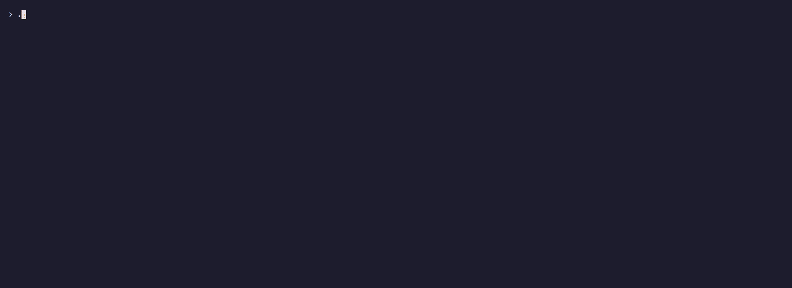
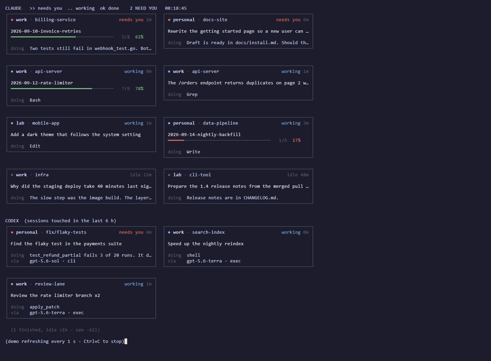

# claude-fleet

PowerShell terminal tools for people who run several Claude Code and Codex CLI sessions, across one or more accounts, on one machine.





Both recordings use made-up data from `demo/fixture.json`. Run any of them with `-Demo` to see the same thing.

## The tools

### ai-usage

Shows how much plan usage is left on every Claude Code and Codex account. Every number is headroom left, not usage spent. It gets the figures from [quota-axi](https://github.com/kunchenguid/quota-axi), a separate npm package. quota-axi reads your Claude Code and Codex login credential files (`.credentials.json` and `auth.json`) and sends those tokens to the vendors' usage endpoints. Because it handles your logins, and because npm packages can run scripts when they install, read [its source](https://github.com/kunchenguid/quota-axi) before you install it. It does not start a model turn, so checking costs nothing. Results are cached for two minutes so a dashboard can't get you rate limited.

```powershell
ai-usage              # cards
ai-usage -Plain       # one line per account, for scripts and agents
ai-usage -Json
ai-usage -Watch       # live, press q to quit
ai-usage -Heal        # also refresh expired Claude tokens (see below)
```

If a Claude token has expired, the account shows "sign-in expired". `-Heal` fixes that by running `claude doctor` on that account, which refreshes the token without starting a session or using quota. It rewrites that account's credential file, so it is off unless you pass `-Heal`. `-NoHeal` is still accepted and does nothing.

### fleet

Shows what every local agent session is doing: which account, which folder, whether it is working or waiting on you, what it was asked, and plan progress when the session reports it. It reads files the agents already write, so watching costs them nothing.

```powershell
fleet                 # cards
fleet -Compact        # one line per session
fleet -Plain -Detail  # dense rows with the ask and the last reply
fleet -Watch
fleet -Usage          # add ai-usage -Plain at the bottom
```

It works on transcripts alone. For better answers (the first thing you asked, the last thing the agent said, and a real "waiting on you" signal), wire up the hook below.

### dash

`ai-usage` and `fleet` in one pane. Usage refreshes every 15 minutes, sessions every `-Every` (default 120s).

```powershell
dash -Watch
dash -Once
```

### vitals

Machine health for chasing crashes: RAM, commit charge (what actually runs out when Node dies with "heap out of memory"), CPU, disks, the heaviest processes, and crashes from the Windows event log.

```powershell
vitals
vitals -Watch         # also logs a sample each frame
vitals -History       # hourly worst readings from the log
vitals -Log           # append one sample and exit, for Task Scheduler
vitals -Json
```

### snapshot

Records which sessions were open and the exact command to resume each one, so a reboot doesn't lose track of them.

```powershell
snapshot              # take one now
snapshot -Restore     # show the last one with a resume command per session
snapshot -Install     # take one every 5 minutes with Task Scheduler
```

`-Install` registers a task named `claude-fleet-snapshot`. Set `snapshotTaskName` in `config.json` to use another name.

### handoff

Writes a hand-off note to a file and prints the command to continue the work in a fresh Claude session. With `-To auto` (the default) it picks the account with the most week left.

```powershell
handoff -Message "Done: parser. Left: tests. Next: run the suite." -DryRun
handoff -File .\notes.md -To personal -Folder C:\src\app
handoff -Message "..." -Launch     # also open a terminal tab
```

### codex-lane

Runs background Codex workers ("lanes") that another agent can start, check on, and keep talking to. Each lane keeps its prompts, event log and final answer in its own folder, and `resume` continues the same Codex session.

```powershell
codex-lane start -Name review -PromptFile .\prompt.md -Account work -Model terra -Effort medium -Dir C:\src\app
codex-lane status -Name review -Wait
codex-lane resume -Name review -Prompt "Now check the tests too."
codex-lane list
```

`-Model` takes the built-in aliases `luna`, `terra`, `sol` and `astra`, any alias you add in `codexModels`, or a full model id. Model ids may only use letters, digits, `.`, `_`, `:` and `-`.

A lane runs with nobody watching, so check these two settings before you start one:

- `-Sandbox` defaults to `workspace-write`: Codex can read files and edit files inside `-Dir`, but not elsewhere. `read-only` allows no edits. `danger-full-access` turns the sandbox off, so Codex can change any file your user account can, run any command, and use the network. Only pass it on purpose.
- `-BypassHookTrust` is off by default. Codex will not run hooks from `~/.codex/hooks.json` until you approve them in an interactive session, and an unattended lane can't ask. With this switch the lane passes `--dangerously-bypass-hook-trust`, which runs every hook in that file without approval. Lanes work without it; only the hooks (such as the fleet state hook) stay silent. Use it only if you trust every hook in that file.
- A lane keeps the sandbox it was started with, saved in its `meta.json`, and `resume` never changes it. A lane started with `danger-full-access` stays that way until you delete its folder and start a new one.

## Install

1. Clone or download the repo anywhere.

2. Add one line to your PowerShell profile (`notepad $PROFILE`):

   ```powershell
   . C:\path\to\claude-fleet\profile.ps1
   ```

   That gives you `ai-usage`, `fleet`, `dash`, `vitals`, `snapshot`, `resume-sessions`, `handoff` and `codex-lane`, plus `claude-<account>` and `codex-<account>` for each account you configure.

3. Optional: list your accounts. With no config file the tools use one account named `default` with the standard `~/.claude` and `~/.codex`.

   ```powershell
   Copy-Item config.example.json config.json
   ```

   The first account uses `~/.claude` and `~/.codex`. Each later one uses `~/.claude-<name>` and `~/.codex-<name>` unless you give `claudeDir` and `codexDir`. To add an account, start the CLI with that folder and log in, for example `claude-personal` after step 2. `config.json` is gitignored. See `lib/config.ps1` for every setting.

4. Optional: wire the state hook, so `fleet` and `snapshot` get facts instead of guesses. In `~/.claude/settings.json`, add this command to the `SessionStart`, `UserPromptSubmit`, `Stop` and `SessionEnd` hooks:

   ```json
   { "type": "command", "command": "node C:/path/to/claude-fleet/hooks/fleet-hook.js claude", "timeout": 10, "async": true }
   ```

   For Codex, add the same four events to `~/.codex/hooks.json` with `fleet-hook.js codex`. The hook writes one small JSON file per session and never blocks the agent.

   Privacy: each file holds plain text copies of the first 400 characters of the session's first prompt, its latest prompt, and the agent's latest reply, plus the working folder. The files live in `<stateDir>/claude/` and `<stateDir>/codex/` (by default `~/.claude/fleet/claude` and `~/.claude/fleet/codex`). Nothing prunes them, so they grow by one file per session. To clear them, delete those two folders; the hook recreates them as needed:

   ```powershell
   Remove-Item ~/.claude/fleet/claude, ~/.claude/fleet/codex -Recurse
   ```

5. Optional: if you ask your agents to track plan progress, have them write `<stateDir>/<session-id>.json` containing `{"plan":"my-plan","done":3,"total":8,"current":4}`. `fleet` shows it as a progress bar.

## Requirements

- PowerShell 7 or later.
- Claude Code and/or the Codex CLI.
- [quota-axi](https://github.com/kunchenguid/quota-axi) for `ai-usage` and `dash` (`npm install -g quota-axi`).
- Node.js for the hook and for Codex thread names in `fleet`.

## Platform notes

- Every tool has only been tested on Windows 11.
- `vitals` is Windows only. It reads Windows performance counters and the event log.
- `codex-lane` is Windows only. It starts workers through WMI so they outlive the shell that started them.
- `snapshot -Install` and `handoff -Launch` use Windows Task Scheduler and Windows Terminal.
- `ai-usage`, `fleet`, `dash`, `snapshot -Restore` and `handoff` without `-Launch` may work on macOS and Linux under PowerShell 7, but they are untested there, and the paths assume Windows separators.
- Codex thread names and models come from the Codex app-server, which only answers for the default `~/.codex` home.

## Recording the GIFs

```powershell
vhs docs/dash.tape
vhs docs/fleet.tape
```

vhs 0.12.0 finishes without writing the file. Use 0.11.0.

## License

MIT
